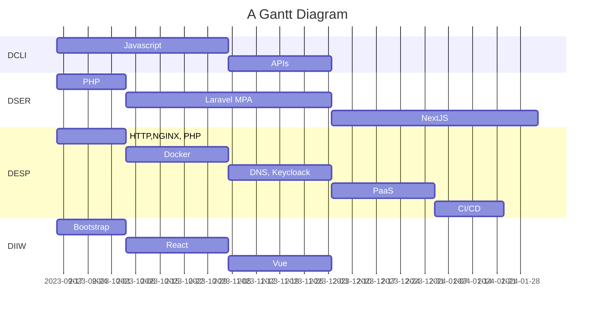

# plans

```mermaid
gantt
    title A Gantt Diagram
    
    dateFormat  YYYY-MM-DD
    section DCLI
    Javascript       :dcli1, 2023-09-15, 50d
    APIs             :dcli2, after dcli1, 30d

    section DSER
    PHP              :dser1, 2023-09-15, 20d
    Laravel MPA      :dser2, after dser1, 60d
    NextJS           :dser4, after dser2, 60d

    section DESP
    HTTP,NGINX, PHP  :desp1, 2023-09-15, 20d
    Docker           :desp2, after desp1, 30d
    DNS, Keycloack   :desp3, after desp2, 30d
    PaaS             :desp4, after desp3, 30d
    CI/CD            :desp5, after desp4, 20d

    section DIIW
    Bootstrap        :diiw1, 2023-09-15, 20d
    React            :diiw2, after diiw1, 30d
    Vue              :diiw3, after diiw2, 30d


```
