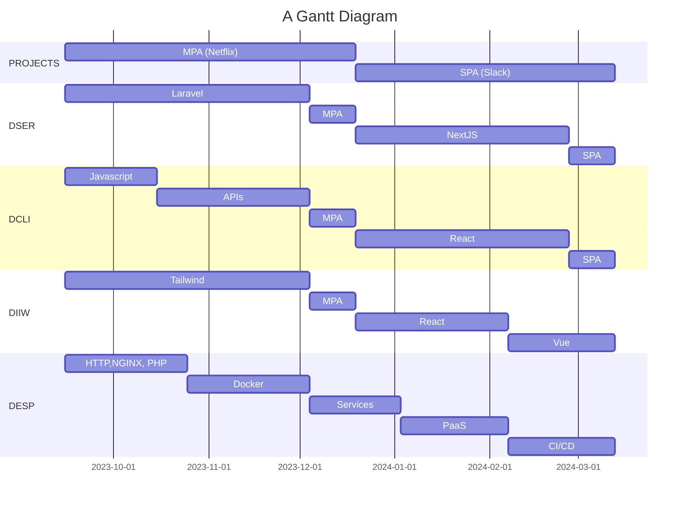

# plans

```mermaid
gantt
    title A Gantt Diagram
    
    dateFormat  YYYY-MM-DD
    
    section PROJECTS 
    MPA (Netflix)    :mpa1, 2023-09-15, 95d
    SPA (Slack)      :spa1, after mpa1, 85d

    section DSER
    Laravel          :dser1, 2023-09-15, 80d
    MPA              :dser2, after dser1, 15d
    NextJS           :dser3, after dser2, 70d
    SPA              :dser4, after dser3, 15d

    section DCLI
    Javascript       :dcli1, 2023-09-15, 30d
    APIs             :dcli2, after dcli1, 50d
    MPA              :dcli3, after dcli2, 15d          
    React            :dcli4, after dcli3, 70d
    SPA              :dcli5, after dcli4, 15d          

    section DIIW
    Tailwind         :diiw1, 2023-09-15, 80d
    MPA              :diiw2, after diiw1, 15d
    React            :diiw3, after diiw2, 50d
    Vue              :diiw4, after diiw3, 35d

    section DESP
    HTTP,NGINX, PHP  :desp1, 2023-09-15, 40d
    Docker           :desp2, after desp1, 40d
    Services         :desp3, after desp2, 30d
    PaaS             :desp4, after desp3, 35d
    CI/CD            :desp5, after desp4, 35d


```

## MPA
Laravel: Eloquent, Sanctum, Storage

APIs: fetch, drag'n'drop, storage

## SPA
NextJS: 

Services: minio